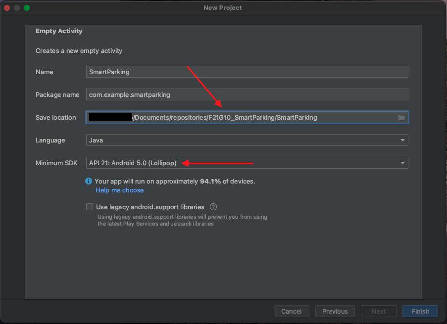

<p align="center"></img></p>
<h1 align="center"><strong>CSIS 3175-003 Project</strong></h1>
<h5 align="center"><strong>Beware, this is a living document and it will be continuously updated!!! 🚀</strong></h5>
<br/>

<blockquote>
  <br/>
  <h2><strong>"Documentation is a love letter that you write to your future self." - Damian Conway</strong></h2>
  <br/>
</blockquote>
<br/>

<!-- <h2>🎯 <strong>Table of Contents</strong></h2>
<br/> -->

<h2>🎯 <strong>Objectives</strong></h2>
<p>
  This repository comprise an <strong>Android Application</strong> that exploit several concepts learned in class. The proposed project is a <strong>Smart Parking</strong> system that provide features such as booking parking spots, payment, cancelation, feedback and others. 
</p>
<br/>

<h2>⚓️ <strong>Navigating Throughout The Documentation</strong></h2>
<p>The repository contains files with the <strong>.md</strong> extension. Those files may contain an overview of a feature or even a side note.</p>
<br/>

<h2>🔍 <strong>Requirements</strong></h2>
  <a href="./assets/guidelines.pdf" target="_blank">Project specifications and requirements</a>
  <br/>
  <br/>
  <p align="center"></p>
<br/>
<br/>

<h2>🏗 <strong>Features List & UI/UX</strong></h2>
  <p>
    <strong><u>Users</u></strong>
    <ul>  
      <li>
        Sign up
      </li>
      <li>
        Sign in
      </li>
      <li>
        Subscription
      </li>
      <li>
        Profile
      </li>
      <li>
        Book parking
      </li>
      <li>
        Cancel booking
      </li>
      <li>
        Invoice
      </li>
      <li>
        Feedback
      </li>      
    </ul>
  </p>
<br/>

<h2>👥 <strong>Contributors</strong></h2>
<br/>
<p style="display: flex; align-items: center; padding-bottom: 20px"> <a style="padding-left: 20px" href="https://github.com/HRBarros">Henrique Barros - 300325470</a></p>
<p style="display: flex; align-items: center; padding-bottom: 20px"> <a style="padding-left: 20px" href="https://github.com/leandrofahur">Leandro Machado - 300326045</a></p>
<p style="display: flex; align-items: center; padding-bottom: 20px"> <a style="padding-left: 20px" href="https://github.com/marimagalhaesl">Mariana Magalhães - 300330330</a></p>
<br/>

<h2>🥷 <strong>Github Best Practices</strong></h2>

<strong>Clone the repository:</strong>

```javascript
$ git clone https://github.com/leandrofahur/F21G10_SmartParking.git
```

<strong>Create your own branch:</strong>

```javascript
$ git checkout -b  <branch_name>
```

If you are in the main branch, this command will copy the main one and create a new branch named <branch_name>.

<strong>Staging, commiting and pushing:</strong>

```javascript
$ git add .
```

```javascript
$ git commit -m "a comment describing what this commit is about"
```

```javascript
$ git push
```

If you are pushing for the first time, git will ask you to execute the command

```javascript
$ git push --set-upstream origin <branch_name>
```

Where the <branch_name> tag is the name of your local branch that is going to be created on the remote repository.

<strong>Always keep things up to date:</strong>

```javascript
$ git pull
```

If you are pulling for the first time, git will ask you to execute a command similar to the one listed for push.

<strong>Wrapping up:</strong>

After finishing your work, and the branch is ready to merge with master, execute the following:

```javascript
$ git checkout master
```

and then

```javascript
$ git merge <branch_name>
```

<strong>Delete branch locally</strong>

```javascript
$ git branch -d localBranchName
```

<strong>Delete branch remotely</strong>

```javascript
$ git push origin --delete remoteBranchName
```

More about can be found in the link on the references section.

<br/>

<h2>📝 <strong>References</strong></h2>
<ol>  
  <li>
    <a href="https://developer.android.com/">
        Android for developers
    </a>
  </li>
  <li>
    <a href="https://docs.github.com/en/repositories/configuring-branches-and-merges-in-your-repository">
        Github - Configuring branches and merges in your repository
    </a>
  </li>
</ol>
<br/>

<h2>🔐 <strong>License</strong></h2>
<p>Copyright © 2021 - This project is <a href="./LICENSE">MIT</a> licensed.</p>
